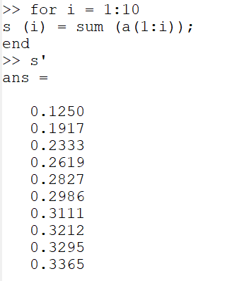
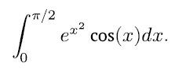
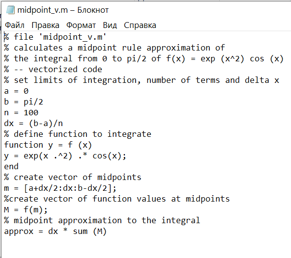
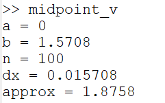

---
# Front matter
lang: ru-RU
title: "ОТЧЕТ ПО ЛАБОРАТОРНОЙ РАБОТЕ №6"
subtitle: "Пределы, последовательности и ряды"
author: "Аминов Зулфикор Мирзокаримович"

# Formatting
toc-title: "Содержание"
toc: true # Table of contents
toc_depth: 2
lof: true # List of figures
lot: true # List of tables
fontsize: 12pt
linestretch: 1.5
papersize: a4paper
documentclass: scrreprt
polyglossia-lang: russian
polyglossia-otherlangs: english
mainfont: PT Serif
romanfont: PT Serif
sansfont: PT Sans
monofont: PT Mono
mainfontoptions: Ligatures=TeX
romanfontoptions: Ligatures=TeX
sansfontoptions: Ligatures=TeX,Scale=MatchLowercase
monofontoptions: Scale=MatchLowercase
indent: true
pdf-engine: lualatex
header-includes:
  - \linepenalty=10 # the penalty added to the badness of each line within a paragraph (no associated penalty node) Increasing the value makes tex try to have fewer lines in the paragraph.
  - \interlinepenalty=0 # value of the penalty (node) added after each line of a paragraph.
  - \hyphenpenalty=50 # the penalty for line breaking at an automatically inserted hyphen
  - \exhyphenpenalty=50 # the penalty for line breaking at an explicit hyphen
  - \binoppenalty=700 # the penalty for breaking a line at a binary operator
  - \relpenalty=500 # the penalty for breaking a line at a relation
  - \clubpenalty=150 # extra penalty for breaking after first line of a paragraph
  - \widowpenalty=150 # extra penalty for breaking before last line of a paragraph
  - \displaywidowpenalty=50 # extra penalty for breaking before last line before a display math
  - \brokenpenalty=100 # extra penalty for page breaking after a hyphenated line
  - \predisplaypenalty=10000 # penalty for breaking before a display
  - \postdisplaypenalty=0 # penalty for breaking after a display
  - \floatingpenalty = 20000 # penalty for splitting an insertion (can only be split footnote in standard LaTeX)
  - \raggedbottom # or \flushbottom
  - \usepackage{float} # keep figures where there are in the text
  - \floatplacement{figure}{H} # keep figures where there are in the text
---

# Ход работы:

# Пределы, последовательности и ряды

Рассмотрим предел:

{ #fig:001 width=70% }

Оценим это выражение с методом анонимной функцией. Это хороший способ быстро определить простую функйию.

{ #fig:001 width=70% }

Далее мы создаём индексную переменную, состоящую из целых чисел от 0 до 9:

{ #fig:001 width=70% }

Теперь мы возьмём степени 10, которые будут входными значениями, а затем оценим f(n).

{ #fig:001 width=70% }
{ #fig:001 width=70% }

# Частичные суммы

Пусть { #fig:001 width=70% } -ряд, n-й член равен

{ #fig:001 width=70% }

Для этого мы определим индксный вектор n от 2 до 11, а затем вычислим члены.

{ #fig:001 width=70% }

Если мы хотим частичную сумму, нам нужно только написать sum(a). Если мы хотим получить последовательность частичных сумм, нам нужно использовать цикл. Мы будем использоватьцикл for с индексом i от 10. Для каждого i мы получим частичную сумму последовательность a_n от первого слагаемого до i-го слагаемого. На выходе получается 10-элементный вектор этих частичных сумм.

{ #fig:001 width=70% }

Наконец, мы построим слагаемые и частичные суммы для 2<= n <= 11.

{ #fig:001 width=70% }
{ #fig:001 width=70% }

# Сумма ряда

Найдем сумму первых 1000 членов гармонического ряда:

{ #fig:001 width=70% }

Нам нужно только сгенировать члены как ряда вектор, а затем взять их сумму.

{ #fig:001 width=70% }

# Частичные интегрирование
# Вычисление интегралов

С помощью команду quar вычислим интеграл:

{ #fig:001 width=70% }

Синтаксис команды -quar('f', a, b). Нам нужно сначала определить функйию.

{ #fig:001 width=70% }

# Аппроксимирование суммами

Напишем скрипт, чтобы вычислить интеграл

{ #fig:001 width=70% }

по правилу средней точки для n = 100.

Введим код в текстовом файле и назавем его midpoint.m.

{ #fig:001 width=70% }

Набрав midpoint в командной строке запустим скрипт

{ #fig:001 width=70% }

Создадим вектор x-координат средних точек. Затем мы оцениваем f по этому вектору средней точки, чтобы получить вектор значений функции. Аппроксимация средней точки -это сумма компонент вектора, умноженная на делтаX.

{ #fig:001 width=70% }

Запустим его.

{ #fig:001 width=70% }

Сравниваем результаты и сравниваем время выполнения для каждой реализации.

{ #fig:001 width=70% }

# Вывод
Научился работать в Octave с пределамы, последовательностами и с рядамы.